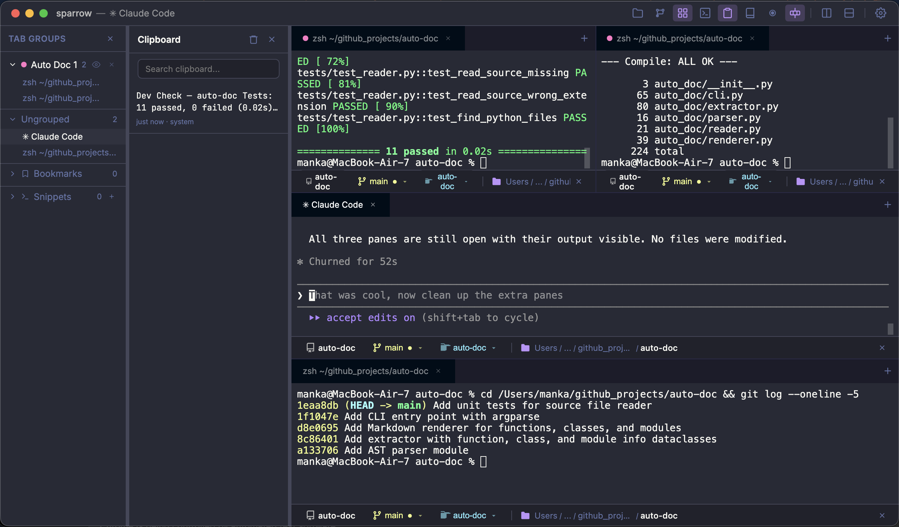
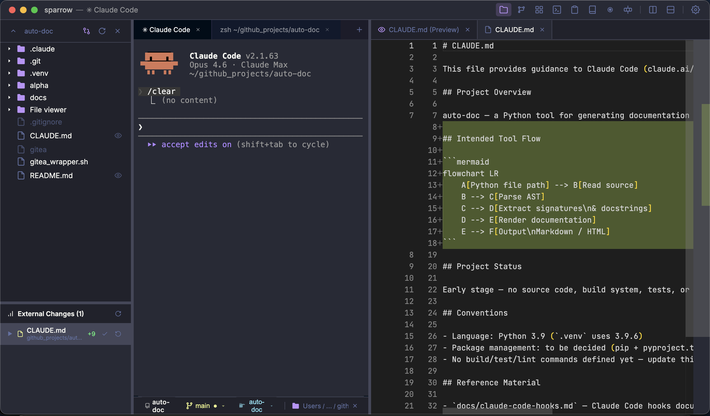
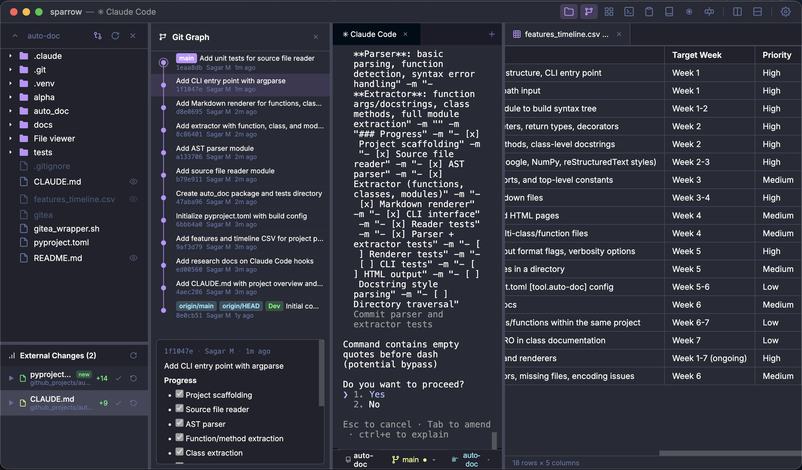

<p align="center">
  
</p>

<h1 align="center">Sparrow</h1>

<p align="center">
  A modern terminal for developers who ship fast.
</p>

<p align="center">
  
  
  
</p>

<p align="center">
  <a href="#install">Install</a> &middot;
  <a href="#features">Features</a> &middot;
  <a href="#mcp-server">MCP Server</a> &middot;
  <a href="#plugins">Plugins</a> &middot;
  <a href="#keyboard-shortcuts">Shortcuts</a>
</p>

---

> **Beta Release** — This is a beta version of Sparrow. Some features are still under active development. Please report any issues you encounter.

## Install

1. Download **sparrow-1.1.1-beta-arm64.dmg** from [Releases](../../releases/latest)
2. Open the `.dmg` and drag **Sparrow** to your Applications folder
3. Launch Sparrow from your Applications folder

### macOS Gatekeeper

This build is **not notarized**, so macOS will block it on first launch. To open it:

1. **Right-click** (or Control-click) the app in Finder
2. Select **Open** from the context menu
3. Click **Open** in the dialog that appears

If that doesn't work, run this in Terminal **before** your first launch:

```bash
xattr -cr /Applications/sparrow.app
```

You only need to do this once — subsequent launches will work normally.

> Requires **macOS 12** (Monterey) or later. Apple Silicon (arm64) only.

---

## What's New in v1.1.1-beta

### Command Palette

Press `Cmd+Shift+R` and type `/` to access 19 built-in commands with fuzzy search, sub-completions, and keyboard navigation.

| Category | Commands |
|----------|----------|
| **Terminal** | `/new`, `/split`, `/close`, `/clear`, `/rename`, `/ssh`, `/snippet`, `/broadcast`, `/find` |
| **Layout** | `/toggle-file-viewer`, `/toggle-git-graph`, `/toggle-tab-groups` |
| **Git** | `/checkout`, `/merge` |
| **App** | `/theme`, `/settings`, `/shortcuts`, `/record`, `/mcp` |

- Type `/theme` + Tab to see available themes, select one to apply instantly
- Type `/ssh` + Tab to pick from saved SSH profiles
- Arrow keys navigate, Tab completes, Enter executes, Escape closes

### Memory Safety & Configurable Limits

- PTY buffer capped at 4 MB to prevent OOM from high-throughput output
- Command block history capped at 200 entries
- Configurable max terminals (default 30) — adjust in Settings (slider 5–100)
- Proper cleanup of all resources on session destroy

### Git Enhancements

- Improved branch popup with search and quick switching
- Worktree popup with create, switch, and delete
- Enhanced git graph visualization

---

## Features

### AI Agent Control via MCP

Let Claude Code, Gemini CLI, or any MCP-compatible agent control your terminal — create panes, run commands, capture output, and manage clipboard. Group tabs, pin clipboard entries, and work across multiple panes at once.

<p align="center">
  
</p>

### File Diff & Revert

Browse your project with the built-in file explorer. See exactly what changed in each file, review diffs inline, and revert unwanted changes — all without leaving the terminal.

<p align="center">
  
</p>

### Git Tree & File Viewer

Visual commit graph, branch management, merge, and worktrees. Open files directly in the built-in Monaco editor with support for 50+ languages, Markdown preview, and CSV tables.

<p align="center">
  
</p>

### Everything Else

| Feature | |
|---|---|
| **Split Panes** | Vertical and horizontal splits — work in multiple terminals side by side |
| **Tabs** | Dynamic titles that reflect the running process and working directory |
| **Session Restore** | Tabs, panes, and working directories are saved and restored on relaunch |
| **Broadcast Input** | Type once, send to every pane — great for multi-server commands |
| **GIF Recording** | Record terminal sessions as animated GIFs with one click |
| **5 Themes** | Dracula (default), Nord, Monokai, Dark, and Light |
| **Notifications** | Desktop alerts when a long-running command finishes |
| **Quick Select** | Regex-based selection of URLs, paths, IPs, and hashes from terminal output |
| **Deep Linking** | `sparrow://open?path=/your/dir` opens a terminal at that directory |
| **Finder Integration** | Drag a folder to the dock icon or use `open -a Sparrow /path` |
| **SSH Profiles** | Saved connections with host, user, port, identity file, and jump host |
| **Clipboard History** | Auto-tracking, pin, search, and re-copy |
| **Tab Groups** | Color-coded groups, location bookmarks, and command snippets |
| **Command Palette** | `Cmd+Shift+R` — 19 commands with fuzzy search, sub-completions, and `/pane`, `/branch`, `/worktree` flags |

---

## MCP Server

The **Sparrow MCP Server** lets AI coding agents (Claude Code, Gemini CLI, etc.) interact with your terminal — create panes, run commands, read output, take screenshots, and more.

### Setup

The MCP server ships inside the app — no separate install needed.

### Add to Claude Code

Edit `~/.claude/settings.json`:

```json
{
  "mcpServers": {
    "sparrow": {
      "command": "node",
      "args": ["/Applications/sparrow.app/Contents/Resources/mcp-server/dist/index.js"],
      "env": {
        "SPARROW_PANE_ID": ""
      }
    }
  }
}
```

### Add to Gemini CLI

Edit `~/.gemini/settings.json`:

```json
{
  "mcpServers": {
    "sparrow": {
      "command": "node",
      "args": ["/Applications/sparrow.app/Contents/Resources/mcp-server/dist/index.js"],
      "env": {
        "SPARROW_PANE_ID": ""
      }
    }
  }
}
```

> `SPARROW_PANE_ID` is set automatically when launching agents from within Sparrow.

### Tools

| Tool | Description |
|------|-------------|
| `sparrow_create_pane` | Open a new terminal pane with an optional command |
| `sparrow_close_pane` | Close a terminal pane |
| `sparrow_rename_pane` | Rename a pane's tab label |
| `sparrow_write_to_pane` | Type text or send signals (Ctrl-C, kill) to a pane |
| `sparrow_run_command` | Run a command and capture its output (ANSI-stripped) |
| `sparrow_screenshot` | Capture a PNG screenshot of a pane |
| `sparrow_notify` | Send a desktop notification |
| `sparrow_clipboard` | Read or write the system clipboard |

### Resources

| URI | Description |
|-----|-------------|
| `sparrow://context` | Your current pane ID and Sparrow environment |
| `sparrow://panes` | All open panes — IDs, names, working directories |
| `sparrow://panes/{id}/output` | Recent terminal output from a pane (last 200 lines) |

### Token Stats Hooks

Track token usage from Claude Code and Gemini CLI directly in your terminal tab headers.

The hook scripts are bundled at `/Applications/sparrow.app/Contents/Resources/mcp-server/hooks/`. See the `README.md` inside that directory for setup instructions.

---

## Plugins

Sparrow supports sidebar plugins — custom panels that run alongside your terminal. Plugins are loaded from `~/.sparrow/plugins/` at startup.

### Plugin Structure

Each plugin is a folder with at least two files:

```
~/.sparrow/plugins/
  my-plugin/
    plugin.json      # manifest (required)
    panel.html       # sidebar UI (required)
    main.js          # main-process code (optional)
```

### plugin.json

The manifest describes your plugin and how it appears in the sidebar:

```json
{
  "name": "my-plugin",
  "displayName": "My Plugin",
  "description": "A short description of what it does",
  "version": "1.0.0",
  "iconSvg": "<svg viewBox='0 0 24 24' fill='none' stroke='currentColor' stroke-width='2' width='16' height='16'><circle cx='12' cy='12' r='10'/></svg>",
  "defaultWidth": 300,
  "minWidth": 200,
  "placement": "left",
  "keybinding": "Meta+Shift+p"
}
```

| Field | Required | Description |
|-------|----------|-------------|
| `name` | yes | Unique identifier (folder name) |
| `displayName` | yes | Label shown in the sidebar |
| `version` | yes | Semver version |
| `description` | no | Short description |
| `iconSvg` | no | Inline SVG for the sidebar icon |
| `defaultWidth` | no | Initial panel width in pixels (default: 300) |
| `minWidth` | no | Minimum resize width (default: 200) |
| `placement` | no | `"left"` or `"right"` (default: `"left"`) |
| `keybinding` | no | Keyboard shortcut to toggle the panel (e.g. `"Meta+Shift+p"`) |

### panel.html

Your UI, rendered inside a sandboxed iframe. Sparrow injects a `SparrowBridge` object you can use to interact with the terminal:

```html
<!DOCTYPE html>
<html>
<head>
  <style>
    body {
      background: #1e1e2e;
      color: #cdd6f4;
      font-family: -apple-system, BlinkMacSystemFont, system-ui, sans-serif;
      font-size: 13px;
      padding: 16px;
    }
  </style>
</head>
<body>
  <h1>Hello from my plugin</h1>
  <p>Current directory: <span id="cwd">...</span></p>

  <script>
    // Get the working directory of the active terminal pane
    SparrowBridge.getCwd().then(function(cwd) {
      document.getElementById('cwd').textContent = cwd;
    });

    // React to directory changes
    SparrowBridge.onCwdChange(function(cwd) {
      document.getElementById('cwd').textContent = cwd;
    });
  </script>
</body>
</html>
```

### SparrowBridge API

The bridge is injected automatically — no imports needed.

| Method | Returns | Description |
|--------|---------|-------------|
| `SparrowBridge.getCwd()` | `Promise<string>` | Working directory of the active pane |
| `SparrowBridge.onCwdChange(callback)` | `function` (unsubscribe) | Called when the active pane's cwd changes |
| `SparrowBridge.readFile(path)` | `Promise<string>` | Read a file from disk |
| `SparrowBridge.writeFile(path, content)` | `Promise<boolean>` | Write a file to disk |
| `SparrowBridge.git.getStatus(cwd)` | `Promise<object>` | Git status (branch, isDirty, isRepo) |
| `SparrowBridge.git.listBranches(cwd)` | `Promise<array>` | List git branches |
| `SparrowBridge.close()` | — | Close the plugin panel |
| `SparrowBridge.theme` | `object` | Current theme colors (`background`, `text`, `textMuted`, `border`, `accent`) |

### main.js (optional)

If your plugin needs to run code in the main (Node.js) process — for example, to register custom IPC handlers — add a `main.js` with an `activate` function:

```js
exports.activate = function(context) {
  // context.ipcMain.handle — register IPC handlers
  // context.app.getPath — Electron app paths
  // context.app.getVersion — Electron app version
}
```

### Getting Started

Copy the included template to get started quickly:

```bash
cp -r plugins/plugin-template ~/.sparrow/plugins/my-plugin
```

Restart Sparrow — your plugin appears in the sidebar. See [`plugins/`](plugins/) for the template and examples.

---

## Keyboard Shortcuts

| Shortcut | Action |
|----------|--------|
| `Cmd+T` | New terminal |
| `Cmd+W` | Close pane |
| `Cmd+D` | Search selected text |
| `Cmd+Shift+D` | Split pane |
| `Cmd+F` | Search in terminal |
| `Cmd+,` | Settings |
| `Cmd+B` | File browser |
| `Cmd+G` | Git panel |
| `Cmd+Shift+V` | Clipboard history |
| `Cmd+Shift+R` | Command palette |
| `Cmd+Shift+B` | Broadcast input |
| `Cmd+Shift+H` | Quick select |
| `Esc` | Close overlay |

## Requirements

- macOS 12 (Monterey) or later
- Apple Silicon (arm64)

## License

Sparrow is proprietary software by Spriggan AI Inc. Free to download and use — not for modification or redistribution. See [LICENSE](LICENSE) for full terms.
